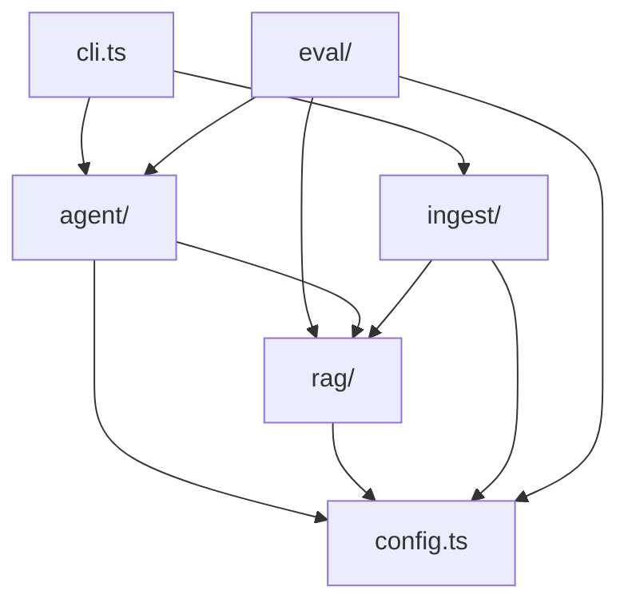
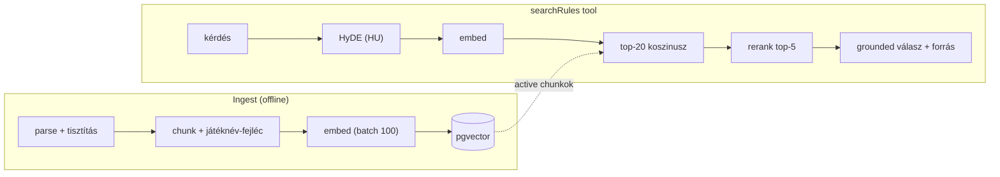
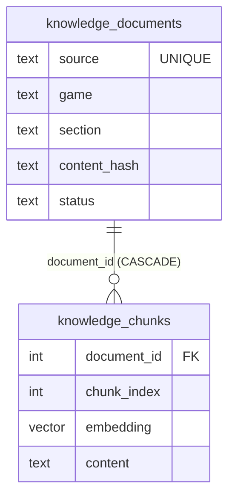

# Architecture Spine — Szabálymester

## Design Paradigm

**Pipes-and-filters** a RAG-folyamatra, **tool-augmentált agent** maggal, **ports & adapters**
a providerekhez.

- **Ingest-cső** (offline, `src/ingest/`): `parse → tisztítás → chunk → embed → store`.
- **Retrieval-cső** (`src/rag/`): `HyDE → embed → tág háló → rerank → kontextus+forrás`.
- **Agent-mag** (`src/agent/`): egy közös tool-use loop; egy agent = system prompt +
  toolkészlet + korlátok. A RAG a modell felé **egyetlen tool** (`searchRules`).
- **Ports & adapters:** a modellhívás egységes portja a Vercel AI SDK; az OpenAI és az
  Anthropic cserélhető adapter (provider-csere = egy import + egy modellnév).
- **Modul-elv:** *egy fogalom = egy könyvtár*. `src/` fogalmi mappákra bomlik
  (`ingest/`, `rag/`, `agent/`, `eval/`) + `config.ts` + `cli.ts`; a közös kód eggyel
  kintebb lakik; egy tool = egy könyvtár mindennel, ami hozzá tartozik.

## Invariants & Rules

### AD-1 — Grounding-szerződés `[ADOPTED]`

- **Binds:** minden válasz-út (FR-15..FR-19, NFR-1).
- **Prevents:** a modell fejből (parametrikus memóriából) vagy forrás nélkül válaszol.
- **Rule:** a válasz-modell KIZÁRÓLAG a visszakapott chunkokból fogalmaz; minden felszínre
  kerülő találat forrást hordoz (játék + szakasz + URL); üres találatnál explicit
  „nincs információm" — kitalált szabály/forrás tilos.

### AD-2 — A retrieval sosem dob `[ADOPTED]`

- **Binds:** `rag/*`, a `searchRules` tool (FR-14, NFR-2).
- **Prevents:** egy elhasaló lépés (HyDE / rerank / DB) kivételként a felhasználóig ér.
- **Rule:** minden lépésnek fallbackje van (HyDE-hiba → eredeti kérdés; rerank-hiba →
  vektorsorrend; üres → explicit „nincs találat" üzenet); a tool `execute`-ja `ToolOutcome`-ot
  ad vissza, sosem dob.

### AD-3 — Egyetlen embedding-tér `[ADOPTED]`

- **Binds:** ingest + retrieval (FR-3, FR-11).
- **Prevents:** a kérdést és a korpuszt más modell vektorizálja → összemérhetetlen vektorok;
  env-ből cserélt modell dimenziója némán ütközik a séma `vector(N)`-jével.
- **Rule:** ugyanaz az embedding-modell vektorizálja a kérdést (HyDE-szöveget) és a
  dokumentumokat; a modell váltása `--rebuild`-et követel.
- **Rule (dimenzió):** az embedding dimenziója a modellből származtatott érték, és meg kell
  egyeznie a séma `vector(N)`-jével; a `config.ts` fail-fast ellenőrzi (eltérés → hiba), a
  dimenzióváltás sémamigrációt + `--rebuild`-et követel.

### AD-4 — Chunk-fejléc + determinizmus `[ADOPTED]`

- **Binds:** `ingest/parse-document`, `ingest/chunk` (FR-1, FR-6..FR-9, NFR-3).
- **Prevents:** anaforikus chunkok játékok közt megkülönböztethetetlenek; nem-tesztelhető
  parse/chunkolás; a fejléc némán kimarad az embeddingből (külön mezőben ragad).
- **Rule:** a `Chunk.content` = `fejléc ("Játék > Szakasz > alcím") + törzs`, és EZ az embed-,
  tárolás- és rerank-bemenet (a fejléc a `content`-be sütve, nem külön csatorna).
- **Rule (determinizmus):** a chunkolás ÉS a `parse-document` (front matter + normalizálás)
  tiszta, determinisztikus függvény, unit-tesztelt (TDD); a chunk-teszt a fejléc jelenlétét is asszertálja.

### AD-5 — Dokumentum/chunk tranzakciós konzisztencia `[ADOPTED]`

- **Binds:** `rag/store`, ingest (FR-3, FR-4, NFR-5).
- **Prevents:** árva chunk / fél-kész dokumentum / elavult vektorok; kétféle „normalizálás"
  → sosem egyező hash; elveszett audit-nyom; nem definiált szinkron-trigger.
- **Rule:** `knowledge_documents` + `knowledge_chunks` (FK, `ON DELETE CASCADE`) egy
  tranzakcióban változnak; a dokumentum-csere (delete+insert+hash-update) atomi.
- **Rule (hash):** egyetlen tiszta, unit-tesztelt `normalize(raw) → string`
  (front-matter-strip, `\r\n`→`\n`, trailing-WS trim, kisbetűsítés NÉLKÜL) táplálja a
  `content_hash`-t; ugyanez a normalizált törzs a chunker bemenete.
- **Rule (életciklus):** a `status = deleted` sor **megmarad** audit-nyomként; a visszatérő
  forrás a meglévő sort újraéleszti (a hash dönt az újravektorizálásról).
- **Rule (trigger):** a szinkron **ütemezetten (cron) és kézzel is** indítható; mindkét út
  ugyanazt a hash-alapú, változással arányos logikát futtatja.

### AD-6 — Config-határ, fail-fast `[ADOPTED]`

- **Binds:** `config.ts`, entry pointok (FR-24, FR-25).
- **Prevents:** hiányzó titok futásidőben derül ki; beégetett modellválasztás.
- **Rule:** env-validáció Zod-dal a határon, fail-fast; titkok kizárólag `.env`-ből; minden
  modellnév env-ből felülírható.

### AD-7 — Routing: olcsó keres, erős válaszol, szétosztott providerek `[ADOPTED]`

- **Binds:** `rag` + `agent` (FR-10, FR-13, FR-16; NFR-6).
- **Prevents:** flagship-ár a keresés-lépésekre; egy provider kiesése elviszi a retrievalt;
  gyenge modell rontja a groundingot.
- **Rule:** HyDE + rerank olcsó modellen, a válasz erős modellen; a HyDE és a rerank
  **külön providernél** fut, így egymástól függetlenül degradálódnak.

### AD-8 — Tool-szerződés `[ADOPTED]`

- **Binds:** `agent/*-tool` (FR-15).
- **Prevents:** a tool kivételt dob a loopba; a modell nyers belsőt lát; párhuzamos registry.
- **Rule:** egy tool = egy könyvtár (modell-felé leírás + Zod-határvalidáció + factory); az
  `execute*` sosem dob (`ToolOutcome`, a rossz inputból is a mi magyar hibaszövegünk lesz);
  egy `report` mellékcsatorna a teljes kimenetet a trace-be küldi, a modell csak a
  `content`-et látja; új tool bekötése = egy sor a toolsetben.
- **Rule (típus):** a `ToolOutcome` egyetlen, Zod-sémás típus a közös kódban — kötelező
  `content: string` (modell-látható) + `report: TraceEntry` (trace-csatorna, saját sémával)
  + `status` diszkriminátor; minden `execute*` pontosan ezt adja, az `eval/` a `TraceEntry`
  sémára épül.

### AD-9 — Függőségi irány (nincs kör)

- **Binds:** `all` (a modulhatárok).
- **Prevents:** körkörös importok; a RAG belső részei az agentbe szivárognak.
- **Rule:** a függőségek a `config`/közös felé mutatnak; a RAG az agent felé KIZÁRÓLAG a
  `searchRules` toolként jelenik meg; `ingest` és `agent` nem importálja egymást.



### AD-10 — Dokumentum-granularitás `[ADOPTED]`

- **Binds:** `ingest/*`, `rag/store`, a grounding-forrás (FR-1, FR-17; AD-1).
- **Prevents:** egy fájlba tömött több szakasz → a dokumentum-szintű `section` hazudik a
  chunkok felének; a fejléc Szakasza és a citált forrás eltér.
- **Rule:** egy korpuszfájl = egy `(game, section)` dokumentum; a `section` kizárólag
  dokumentum-tulajdon; minden chunk a **dokumentumától örökli** a szekciót (a chunker
  inputként kapja, nem `##`-ból parse-olja). A grounding-forrás és a fejléc Szakasza így
  egyetlen forrásból (a `knowledge_documents` sorból) származik.

### AD-11 — Usage-naplózás minden modellhíváson

- **Binds:** `rag/*`, `agent/*`, `eval/*` (FR-23, SM-4).
- **Prevents:** a költség nem mérhető; a válasz-modell dominanciája (80–90%) láthatatlan.
- **Rule:** minden modellhívás (embedding, HyDE, rerank, válasz) a Vercel AI SDK `usage`-én
  át naplózza a token-használatot; az ingest és a retrieval trace ezt költséggé aggregálja.

## Consistency Conventions

| Concern | Convention |
| --- | --- |
| Névadás | fájlnév `kebab-case` szerep-utótaggal (`*-tool.ts`, `*-prompt.ts`, `*.spec.ts`); `camelCase` változó/fn, `PascalCase` típus, `UPPER_SNAKE` konstans; a teszt a kód mellett (`chunk.ts` → `chunk.spec.ts`) |
| Adat & formátumok | `section` enum: `attekintes\|elokeszules\|jatekmenet\|pontozas\|gyik`; `status` enum: `active\|deleted`; `embedding vector(1536)`; `source` = egyedi URL/út; `content_hash` = a normalizált törzs SHA-256-ja; hibák a tool-határon `ToolOutcome`-ként (nem kivétel); Zod a rendszer-határokon: env, tool-input, **LLM-output** (a rerank `generateObject` strukturált kimenete) |
| Állapot & keresztmetsző | DB-mutáció csak paraméterezett SQL-lel, tranzakción belül; strukturált **trace** (nem `console.log`) a retrieval-lépésekre; konfiguráció csak `config.ts`-en át `.env`-ből; nyelv: korpusz + HyDE + válasz **magyar** |

## Stack

_SEED — a szerzéskor web-ellenőrzött; a kód birtokolja, ha létrejött. A modellnevek env-ből
felülírható alapértelmezések (AD-6)._

| Name | Version |
| --- | --- |
| Node.js | 24 LTS |
| TypeScript | 5.9 (strict) |
| pnpm | 11 |
| Vercel AI SDK (`ai`) | 7 |
| `@ai-sdk/openai`, `@ai-sdk/anthropic` | AI SDK 7-kompatibilis |
| Zod | 4 |
| Vitest | 4 |
| tsx | 4 |
| PostgreSQL | 17 |
| pgvector | 0.8.x |
| Embedding-modell | `text-embedding-3-small` (OpenAI) |
| HyDE-modell | `gpt-5.4-nano` (OpenAI) |
| Rerank-modell | `claude-haiku-4-5` (Anthropic) |
| Válasz-modell | `claude-sonnet-5` (Anthropic) |

## Structural Seed

```text
szabalymester-tarsasjatek-asszisztens/
  src/
    ingest/    # parse-document, chunk (+ chunk.spec), ingest
    rag/       # embed, store, hyde, rerank, retrieve
    agent/     # agent (loop), prompt, search-rules-tool
    eval/      # golden-set.json, run-golden-set
    config.ts  # Zod env-validáció, fail-fast
    cli.ts     # kérdés-válasz + debug parancsok
  db/schema.sql            # knowledge_documents + knowledge_chunks
  seed/rules/*.md          # korpusz (front matterrel)
  docker-compose.yml       # pgvector/pgvector:pg17
```

**Adatfolyam (pipe-ok):**



**Mag-entitások:**



**Üzemeltetési boríték:** v1 lokális/CLI; a Postgres+pgvector `docker-compose`-ból; titkok
`.env`-ből; nincs felhő-deploy. A séma friss initdb-mountként és kézi `db:schema`-ként is
alkalmazható.

## Capability → Architecture Map

| Capability / Area | Lives in | Governed by |
| --- | --- | --- |
| 4.1 Tudásbázis + ingest (FR-1..5) | `ingest/`, `rag/store` | AD-3, AD-5, AD-6, AD-10 |
| 4.2 Chunkolás (FR-6..9) | `ingest/chunk` | AD-4 |
| 4.3 Retrieval-pipeline (FR-10..14) | `rag/hyde`, `rag/rerank`, `rag/retrieve` | AD-2, AD-3, AD-7 |
| 4.4 Grounded agent (FR-15..19) | `agent/` | AD-1, AD-7, AD-8 |
| 4.5 Eval + observability (FR-20..23) | `eval/`, `rag/retrieve` (trace) | AD-2, AD-11 |
| 4.6 Config + biztonság (FR-24..25) | `config.ts` | AD-6 |

## Deferred

- **`pipeline_version` detektálás** (PRD Open Q4): a chunker/embedding-modell verzió
  nyilvántartásának módja — a v1 kézi `--rebuild`; a tárolt `pipeline_version` oszlop + auto-
  detektálás később.
- **Approximate vektor-index (HNSW/IVFFlat):** a kis korpuszon a pontos seq-scan gyors; a
  golden-set pontos top-K-t igényel. Nagyobb korpusznál kerül be.
- **v2/v3 bővítések** (PRD §6.2): metaadat-szűrés, LLM-judge, abstention-küszöb, multi-turn,
  CI; abláció, chunking A/B, hibrid keresés (BM25+vektor).
- **Chunk-méret / `WIDE_NET` / `KEEP_TOP` végleges hangolása:** a golden-set futásokból.
