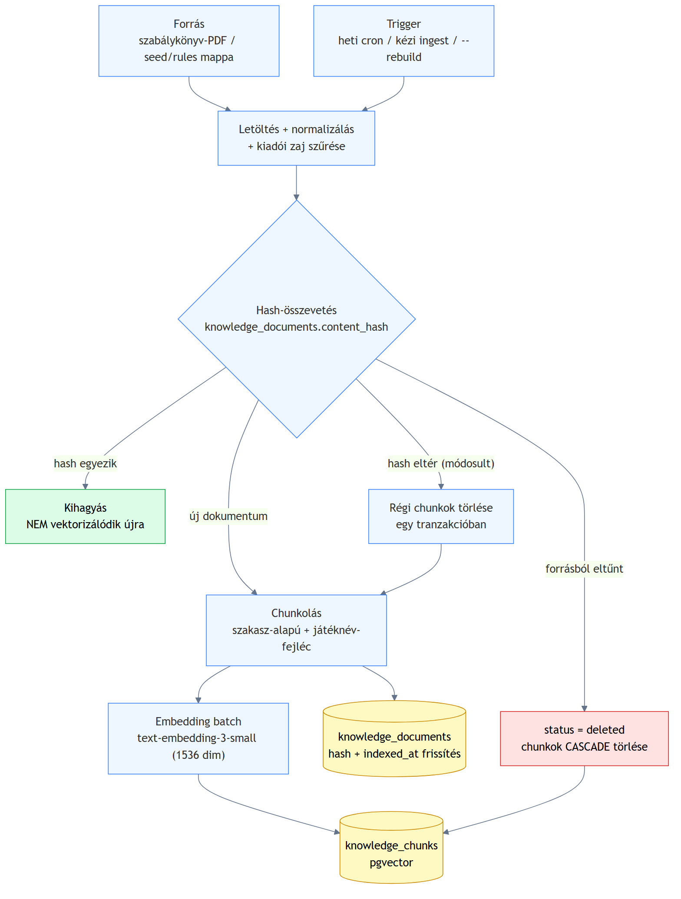
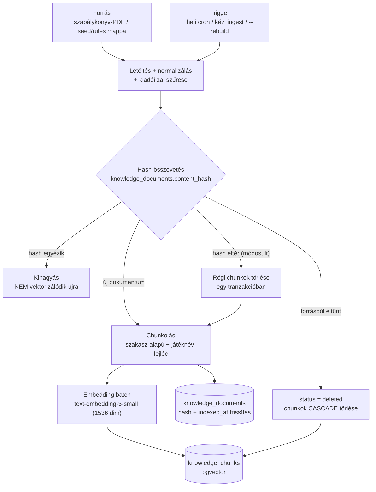

# ARCHITEKTURA — a tudásbázis karbantartása (terv, nem kód)

> Ez a dokumentum leírja, hogyan oldjuk meg az **inkrementális frissítést** —
> változásérzékelés, új dokumentum, törölt dokumentum chunkjai, újraindexelés triggere —
> plusz az architektúra-ábra (export a repóban).

## 0. Kiindulás — mi a probléma?

A forrás (a hivatalos szabálykönyvek / a `seed/rules/` mappa) nem statikus: a kiadó új
kiadású (errata-zott) szabálykönyvet ad ki, új játék kerül a korpuszba, régi kikerül.
A vektortár ilyenkor a *tegnapi igazságot* mondja — társasjátéknál ez különösen fájó,
mert egy errata épp a szabály értelmét fordíthatja meg.
A legegyszerűbb stratégia a **teljes újraépítés** (TRUNCATE + teljes újravektorizálás) —
kis korpusznál működik, de: (1) minden futás a TELJES korpusz embedding-költségét fizeti,
(2) a frissítés alatt a tudásbázis üres/fél-kész, (3) nem skálázódik. A terv ezt váltja
ki inkrementális frissítéssel.

## 1. Séma-kiegészítés — a dokumentum mint első osztályú entitás

A chunk-tábla mellé egy **dokumentum-nyilvántartás** kerül; e nélkül nincs mihez képest
változást érzékelni:

```sql
knowledge_documents (
  id           serial primary key,
  source       text unique,      -- a dokumentum azonosítója (URL vagy fájl-út)
  title        text,
  game         text,             -- melyik játék (a chunk-fejléc és a szűrés alapja)
  section      text,             -- attekintes | elokeszules | jatekmenet | pontozas | gyik
  content_hash text,             -- a NORMALIZÁLT törzs SHA-256 hash-e
  chunk_count  int,
  indexed_at   timestamptz,      -- mikor vektorizáltuk utoljára
  status       text              -- active | deleted
)

knowledge_chunks (
  ...mint eddig...,
  document_id  int references knowledge_documents(id) ON DELETE CASCADE
)
```

Kulcsdöntés: a `content_hash` a **zaj-szűrés és normalizálás UTÁNI** törzsből készül —
így a kiadói impresszum, a jogi sor vagy a whitespace változása NEM triggerel
újravektorizálást, csak az érdemi szabály-tartalom változása (pl. egy errata).

## 2. A négy kulcskérdés megválaszolása

### 2.1 Honnan tudjuk, hogy egy dokumentum változott?

**Tartalom-hash összevetés.** A szinkron-futás minden forrás-dokumentumra kiszámolja a
normalizált törzs SHA-256 hash-ét, és összeveti a `knowledge_documents.content_hash`-sel:

- hash egyezik → **kihagyjuk** (nem vektorizálódik újra — ez a költségvédelem magja)
- hash eltér → a dokumentum **módosult** → újra-chunkolás + újra-embedding
- nincs a nyilvántartásban → **új** dokumentum
- a nyilvántartásban van, de a forrásban már nincs → **törölt**

Miért hash és nem mtime/ETag? A fájl-dátum letöltéskor változik tartalomváltozás nélkül
is (hamis pozitív); az ETag a forrásszervertől függ. A hash a mi kontrollunk alatt áll,
és pontosan azt méri, ami számít: az érdemi tartalmat. (Ha a forrás ad megbízható
`Last-Modified`/ETag-et, az OLCSÓ előszűrőnek használható a letöltés megspórolására —
de a döntő szó a hash-é.)

### 2.2 Mi történik az új dokumentummal?

1. front matter parse + zaj-szűrés + normalizálás
2. sor a `knowledge_documents`-be (hash, status=active)
3. chunkolás a stratégia szerint → embedding (batch) → chunkok beírása `document_id`-vel
4. `indexed_at` beállítása

A módosult dokumentum ugyanez, plusz **előtte** a régi chunkjai törlődnek — a csere
egyetlen tranzakcióban (delete + insert + hash-update), így a kereső sosem lát
fél-kész állapotot, és áramszünetnél sem marad vegyes (régi+új) chunk-készlet.

### 2.3 Mi történik a törölt dokumentum chunkjaival?

- A dokumentum `status = deleted` jelölést kap, a chunkjai **azonnal törlődnek**
  (a `document_id` FK + `ON DELETE CASCADE` garantálja, hogy árva chunk nem maradhat).
- Miért soft-delete a dokumentum-soron? (1) audit-nyom: látszik, MI és MIKOR tűnt el;
  (2) ha a forrás átmenetileg hibázik (a letöltés nem éri el a szabálykönyvet), a visszatérő
  dokumentum a meglévő sorát élesztheti újra, és a hash dönt az újravektorizálásról.
- A keresés csak `status = active` dokumentumok chunkjaiban fut (a törlés miatt ez
  implicit teljesül, mert a chunk fizikailag nincs — a status a nyilvántartásnak szól).

### 2.4 Mikor / mi triggereli az újraindexelést?

Három, egymást kiegészítő trigger:

| Trigger | Mikor | Mire jó |
|---|---|---|
| **Ütemezett szinkron** (cron, pl. hetente éjjel) | rendszeresen | a szabálykönyv-korpusz ritkán változik (errata, új kiadás); a heti frissesség bőven elég, és a futás olcsó, mert a hash-egyezők kimaradnak |
| **Kézi futtatás** (`pnpm ingest`) | fejlesztés közben / tudott változásnál | azonnali, kontrollált frissítés |
| **Kényszerített teljes újraépítés** (`pnpm ingest --rebuild`) | chunking-stratégia vagy embedding-modell változásakor | ilyenkor a hash-ek érvénytelenek: MINDENT újra kell vektorizálni (a vektortér vagy a darabolás megváltozott) |

Fontos megkülönböztetés: a **tartalomváltozás** inkrementális frissítést triggerel,
a **pipeline-változás** (más chunker, más embedding-modell) teljes újraépítést —
a kettőt a rendszer nem keverheti, ezért a chunker/modell verziója is a
nyilvántartásba kerülhet (pl. `pipeline_version` oszlop), és eltérésnél a szinkron
teljes újraépítést követel.

## 3. Adatfolyam-ábra

Az adatfolyam: forrás → változásérzékelés → chunk → embed →
tárolás, külön jelölve a törlés/módosítás útja. A kép Mermaidből renderelve
(`npx @mermaid-js/mermaid-cli`), a forrás verziózva a repóban:

- kép: [`docs/abra/tudasbazis-karbantartas.png`](abra/tudasbazis-karbantartas.png)
- forrás: [`docs/abra/tudasbazis-karbantartas.mmd`](abra/tudasbazis-karbantartas.mmd)



Az ábra forrása (Mermaid):



## 4. Költség-hatás

- Változatlan korpusz melletti heti szinkron embedding-költsége: **0** (minden hash
  egyezik, egyetlen API-hívás sincs).
- N módosult/új dokumentum → csak azok chunkjai embeddelődnek (dokumentumonként
  jellemzően 5-10 chunk × ~250-300 token) — a költség a változással arányos, nem a
  korpuszmérettel.
- Teljes újraépítés (modell-/chunkerváltás) = az ingest teljes költsége (ld. README
  költségbecslés) — ezért csak explicit `--rebuild`-del futhat.

## 5. Amit tudatosan nem terveztünk be (és miért)

- **Valós idejű (webhook-alapú) frissítés** — a szabálykönyv-kiadás nem ad webhookot, és
  a szabály nem percre pontos műfaj; a heti cron a tartalom természetéhez illik.
- **Chunk-szintű diff** (csak a változott szakasz újra-embeddelése) — a dokumentumok
  kicsik (5-10 chunk), a dokumentum-szintű csere egyszerűbb és tranzakcionálisan
  tisztább; chunk-diff csak nagy (100+ chunkos) dokumentumoknál érné meg.
- **Külön vektor-adatbázis termék** — a pgvector a meglévő Postgresben tart mindent
  (dokumentum-nyilvántartás + chunkok EGY tranzakciós határon belül) — pont az
  inkrementális frissítés konzisztenciájához ez a legnagyobb érv a pgvector mellett.
